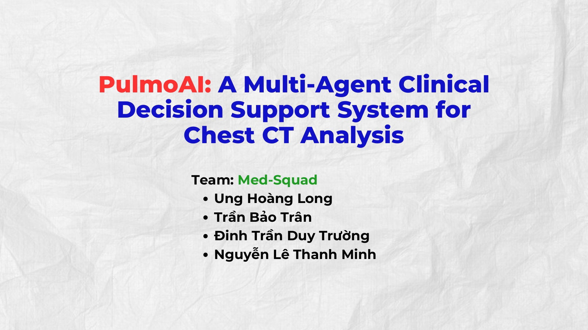
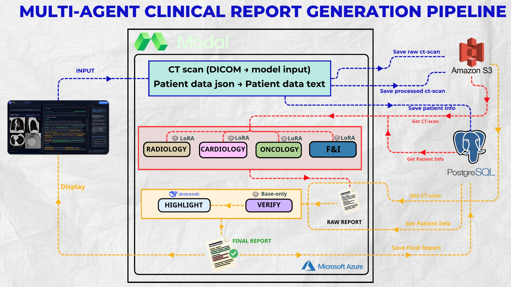
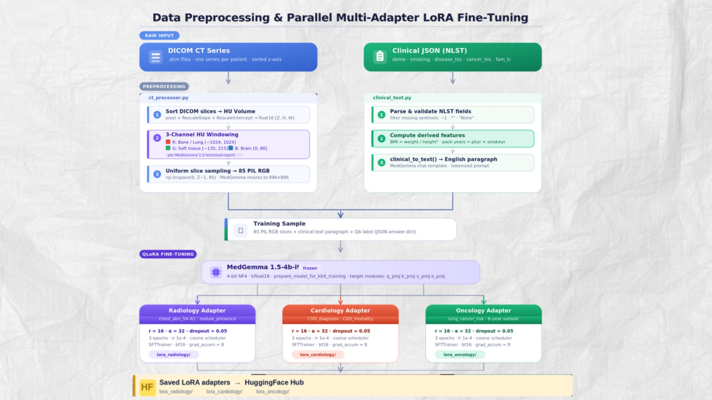
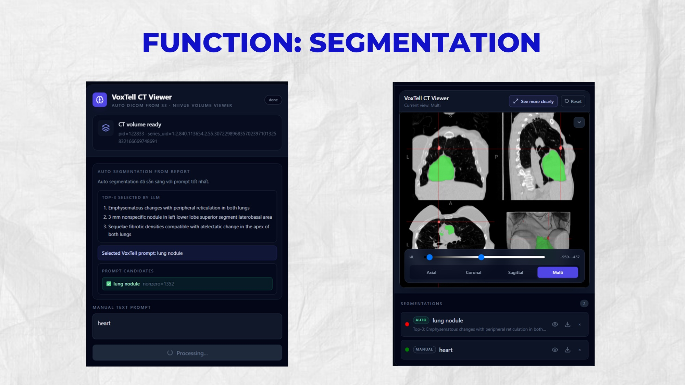
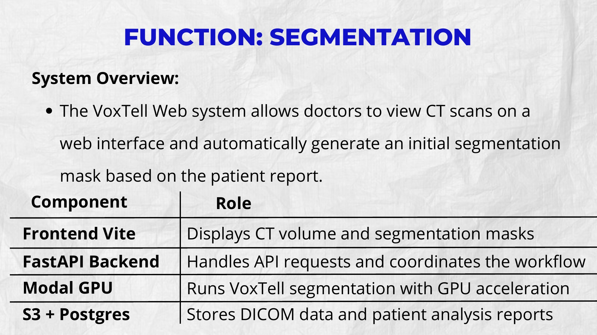
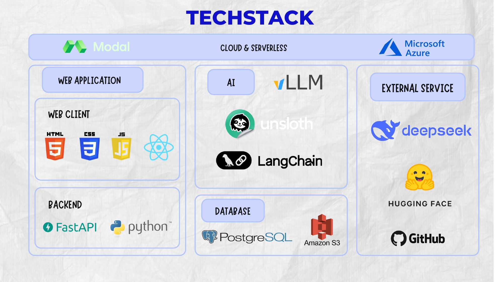

<p align="center">
  
</p>

<h1 align="center">PulmoAI</h1>
<p align="center"><i>Multi-agent clinical decision support for chest CT analysis<br>胸部CT画像のためのマルチエージェント臨床意思決定支援システム</i></p>

<p align="center">
  <b>Team:</b> Med-Squad &nbsp;·&nbsp;
  <b>Dataset:</b> <a href="https://openm3chest.org">OpenM3Chest</a> & <a href="https://huggingface.co/datasets/ibrahimhamamci/CT-RATE">CT-RATE</a> &nbsp;·&nbsp;
  <b>Backbone:</b> MedGemma 1.5-4B-IT (LoRA) &nbsp;·&nbsp;
  <b>Infra:</b> Modal · AWS S3 · PostgreSQL · Azure
</p>

---

A multi-agent AI system that analyzes chest CT scans across five clinical specialties — Radiology, Cardiology, Oncology, Findings & Impressions, and Verification — in one pipeline, then surfaces the results through an interactive report viewer, CT segmentation tool, and clinical chatbot.

Developed by student team **Med-Squad** (University of Information Technology, HCMC) during the OJT program organized by **[HuReDee — 一般社団法人 外国人材支援機構](https://www.huredee.org/news/news60.html)**, under the mentorship of **[IoYou Inc. (Japan)](https://ioyou.co.jp/assets/index.php)**.

---

## Abstract

| | |
|---|---|
| **Problem** | Lung cancer is the #1 cause of cancer death — yet diagnosis relies on scarce specialist expertise. |
| **Gap** | Existing AI diagnostic tools address only a single specialty, with no integrated clinical view from a single scan. |
| **Solution** | **PulmoAI** — a multi-agent system analyzing chest CT scans across 5 specialties in one pipeline. |
| **Method** | MedGemma + LoRA · VoxTell auto-segmentation · LangGraph conversational agent |
| **Deployment** | Full-stack web app — accessible without specialist hardware |

---

## System Architecture

A DICOM CT series and structured clinical JSON are routed through four LoRA-specialized MedGemma agents plus an unbiased base-model Verification agent, producing a highlighted, verified clinical report — with every artifact persisted to S3/PostgreSQL for the frontend to render, GPU inference on Modal, and the web app served behind Microsoft Azure.

<p align="center">
  
</p>

Each specialist is a QLoRA adapter (`r=16, α=32`) trained on a frozen, 4-bit quantized MedGemma 1.5-4B-IT, sharing one preprocessing pipeline for CT slices (3-channel HU windowing) and clinical text:

<p align="center">
  
</p>

---

## Features

- **Multi-agent report generation** — Radiology, Cardiology, Oncology, and Findings & Impressions agents each produce structured findings; an independent, unbiased **Verification Agent** cross-checks them and flags disagreements as clinical red flags rather than silently picking a winner.
- **Interactive CT segmentation (VoxTell)** — auto-reads the generated report, has an LLM pick the top-3 clinically relevant findings, tests each as a prompt against VoxTell on a Modal GPU, and overlays the best mask — doctors can still run manual prompts (e.g. `"heart"`).
- **Clinical RAG chatbot** — LangGraph agent grounded in each patient's own report, clinical data, and chat history, with MCP tools for drug-interaction checks and safety warnings.
- **Speech-to-text** — medical-terminology-tuned Whisper (`faster-whisper`, CPU) lets doctors dictate questions instead of typing.

<p align="center">
  
  &nbsp;&nbsp;
  
</p>

---

## Results

Evaluated with BLEU/ROUGE, BERT-Score, and per-task F1. LoRA fine-tuning turned a non-functional base model into a clinically usable specialist across every domain:

| Domain | Task | Base | Fine-tuned |
|---|---|---|---|
| Radiology | Chest abnormality (avg) | ~0.58 | up to **1.00** (with CoT) |
| Cardiology | CVD diagnosis | 0.21 | **0.55** (with CoT) |
| Cardiology | CVD mortality | 0.10 | **0.94** |
| Findings & Impressions | BERT-Score | 0.913 | **0.940** |

Full metric tables per agent are in the [presentation deck](IoYou_Presentation.pdf).

---

## Tech Stack

<p align="center">
  
</p>

---

## Repository Structure

This repo contains the **AI/ML side** — data pipeline, training, serving, and agent logic. The **backend API and frontend** live in a separate repo (`ai-medical-web`).

```
ai-medical-dept/
├── agents/                  # Per-agent logic
│   ├── data_prep/           # CT preprocessing (.npy slicing) + clinical text
│   ├── radiology/           # LoRA radiology — lung abnormality detection
│   ├── cardiology/          # LoRA cardiology — CVD diagnosis + mortality risk
│   ├── oncology/            # LoRA oncology — 6-year lung cancer risk
│   ├── synthesis/           # SVFM cross-modal fusion (combines agent outputs)
│   ├── report/              # Structured clinical report generation
│   └── doctor_interface/    # RAG + MedASR (chatbot, text/voice)
├── training/                # QLoRA fine-tuning scripts
├── serving/                 # FastAPI inference server + LoRA adapter management
├── retrieval/                # FAISS index build + query (RAG)
├── configs/                  # YAML configs for training and serving
├── docker/                   # Dockerfiles for GPU training/serving
├── scripts/                  # Setup, training, index-building scripts
├── docs/                      # Architecture docs + images used in this README
├── tests/                     # Unit and integration tests
└── Notebooks/                 # EDA and baseline evaluation
```

---

## Quickstart

```bash
git clone https://github.com/UngHoangLong/ai-medical-dept.git
cd ai-medical-dept
python -m venv venv && source venv/bin/activate
pip install -r requirements/base.txt

cp .env.example .env   # fill in HF_TOKEN, DATA_ROOT
```

```python
from huggingface_hub import snapshot_download
snapshot_download(repo_id="UngLong/openm3chest-labels", repo_type="dataset", local_dir="data/")
```

```bash
bash scripts/vastai_train.sh radiology   # fine-tune an agent on a GPU instance
```

> See [CONTRIBUTING.md](CONTRIBUTING.md) for the team Git workflow.

---

## Agents

| Agent | LoRA | Training data | Samples |
|---|---|---|---|
| Radiology | `lora_radiology` | chest_abn (×7), nodule_* | ~320k |
| Cardiology | `lora_cardiology` | CVD_diagnosis + CVD_mortality | ~47k |
| Oncology | `lora_oncology` | lung_cancer_risk | ~46k |
| Findings & Impressions | `lora_findings_impressions` | CT-RATE Findings/Impressions | 500 train / 200 test |
| Verification / Doctor Interface | — (base MedGemma) | — | — |

---

## Team — Med-Squad

| Name | Role |
|---|---|
| **Ung Hoàng Long** | Team Lead |
| Trần Bảo Trân | Member |
| Đinh Trần Duy Trường | Member |
| Nguyễn Lê Thanh Minh | Member |

---

## References

1. I. E. Hamamci et al., "Generalist foundation models from a multimodal dataset for 3D computed tomography," *Nature Biomedical Engineering*, 2026.
2. J. Hofmanninger et al., "Automatic lung segmentation in routine imaging is primarily a data diversity problem," *European Radiology Experimental*, 4(1), 2020.
3. A. Sellergren et al., "MedGemma 1.5 technical report," *arXiv:2604.05081*, 2026.
4. C. Niu et al., "Medical multimodal multitask foundation model for lung cancer screening," *Nature Communications*, 16(1), 2025.
5. J. Ma et al., "Segment anything in medical images," *Nature Communications*, 15(1), 2024.
6. M. Rokuss et al., "VoxTell: Free-text promptable universal 3D medical image segmentation," *CVPR*, 2026.

## License

Research use only. MedGemma is subject to the [Health AI Developer Foundations terms](https://developers.google.com/health-ai-developer-foundations/terms).
